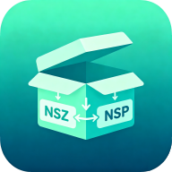

<p align="center"></p>

# Nsz for Android (nszapp)

> ⚡ **Powered by AI** — This project is the Android port of [nsz2nsp](https://github.com/newnight/nsz2nsp): the Swift decompression core was ported to Kotlin through human–AI collaboration (WorkBuddy).
> ⚡ **Powered by AI** — 本项目是 [nsz2nsp](https://github.com/newnight/nsz2nsp) 的 Android 移植版：Swift 解压核心经人机协作（WorkBuddy）移植为 Kotlin 实现。

> 🖥️ **macOS version / macOS 版**：[nsz2nsp](https://github.com/newnight/nsz2nsp) — the original Swift implementation.
> 🖥️ **macOS 版**：[nsz2nsp](https://github.com/newnight/nsz2nsp) —— 原始 Swift 实现。

A native Android NSZ / NCZ decompressor (NSZ → NSP, NCZ → NCA). Pick a file, pick an output folder, tap extract — that's it.
一款 Android 原生的 NSZ / NCZ 解压工具（NSZ → NSP，NCZ → NCA）。选文件、选输出文件夹、点解压，就这么简单。

> ⚠️ Decompression only — this tool does not pack or create `.nsz` / `.ncz` files. For packing, use the original [nsz](https://github.com/nicotine-plus/nsz) tool.
> ⚠️ 仅支持解压 —— 本工具不打包、不生成 `.nsz` / `.ncz` 文件，打包请使用原版 [nsz](https://github.com/nicotine-plus/nsz) 工具。

## Features / 特性

- Full NSZ → NSP / NCZ → NCA decompression, a Kotlin port of the shared `NszCore` logic, supporting both solid and block compression modes.
- 完整 NSZ → NSP / NCZ → NCA 解压，核心逻辑从 `NszCore` 逐字节移植为 Kotlin，支持 solid 与 block 两种压缩模式。

- Decompress only (no packing): reads `.nsz` / `.ncz`, writes `.nsp` / `.nca` — it never compresses in the other direction.
- 仅解压（不打包）：读取 `.nsz` / `.ncz`，输出 `.nsp` / `.nca`，不做反向压缩。

- Zero-hole corruption scan: detects contiguous zero regions in the compressed stream (a typical sign of download/transfer corruption) before extraction and warns you up front.
- 零洞损坏扫描：解压前扫描压缩流中的连续全零区（下载/传输损坏的典型特征），提前告警，避免产出损坏文件。

- SHA-256 verification: every NCA is hash-checked after decompression.
- SHA-256 哈希校验：逐 NCA 校验解压结果。

- Rename on conflict: if the output already exists, a timestamp suffix is added (`Game 2026-09-05 01.14.30.nsp`) — never overwrites.
- 重名自动改名：输出文件已存在时按时间加后缀（`Game 2026-09-05 01.14.30.nsp`），绝不覆盖。

- Storage Access Framework: no storage permission needed — pick the NSZ file and the output folder via the system file picker (Android 8.0+).
- 基于 SAF（存储访问框架）：无需存储权限——通过系统文件选择器选择 NSZ 文件与输出文件夹（Android 8.0+）。

- Live progress bar and per-entry verification results.
- 实时进度条与逐条目校验结果展示。

## Install / 安装

Build the APK from source (see below), or grab one from [Releases](../../releases), then install:
从源码构建 APK（见下文），或前往 [Releases](../../releases) 下载，然后安装：

```bash
adb install Nsz-debug.apk
```

Or copy the APK to the device and open it directly.
或将 APK 拷贝到设备后直接打开安装。

## Usage / 使用

1. Tap 「选择 NSZ / NCZ 文件」 and pick a file.
1. 点击「选择 NSZ / NCZ 文件」选择文件。

2. Tap 「选择输出文件夹」 and pick where the result goes.
2. 点击「选择输出文件夹」选择输出位置。

3. Tap 「开始解压」 — progress and verification results are shown live.
3. 点击「开始解压」——实时显示进度与校验结果。

The output is written to the chosen folder; conflicting names get a timestamp suffix instead of being overwritten.
结果写入所选文件夹；同名文件自动按时间改名，不会被覆盖。

## Building from Source / 从源码构建

Requirements: Android Studio (or Gradle 8.x + JDK 21 + Android SDK 34).
环境要求：Android Studio（或 Gradle 8.x + JDK 21 + Android SDK 34）。

```bash
git clone <repo>
cd nszapp

# Point local.properties at your SDK if needed / 如需要请在 local.properties 指定 SDK 路径
# sdk.dir=/path/to/android-sdk

gradle assembleDebug          # build the debug APK / 构建 debug APK
```

The APK lands at `app/build/outputs/apk/debug/`.
产物位于 `app/build/outputs/apk/debug/`。

## Byte-level Tests / 字节级测试

`jvmtest/TestMain.kt` runs the Kotlin decoder on the [nsz2nsp](https://github.com/newnight/nsz2nsp) test fixtures and byte-compares every output against the expected files (not part of the APK):
`jvmtest/TestMain.kt` 使用 [nsz2nsp](https://github.com/newnight/nsz2nsp) 的测试样本运行 Kotlin 解码器，并对输出做逐字节比对（不打入 APK）：

```bash
kotlinc jvmtest/TestMain.kt app/src/main/java/com/biu/nsz/NszDecoder.kt -include-runtime -d test.jar
java -jar test.jar <testdata-dir> <out-dir>
```

## Technical Notes / 技术说明

- zstd via [zstd-jni](https://github.com/luben/zstd-jni) AAR (`1.5.7-3@aar`), bundling `libzstd.so` for armeabi-v7a / arm64-v8a / x86 / x86_64.
- zstd 使用 [zstd-jni](https://github.com/luben/zstd-jni) 的 AAR 包（`1.5.7-3@aar`），自带 armeabi-v7a / arm64-v8a / x86 / x86_64 四种 ABI 的 `libzstd.so`。

- AES-CTR re-encryption for cryptoType 3/4 NCZ sections uses `javax.crypto` (AES/CTR/NoPadding) with NCA absolute-offset addressing.
- cryptoType 3/4 的 NCZ section 通过 `javax.crypto`（AES/CTR/NoPadding）按 NCA 绝对偏移寻址做 AES-CTR 重加密。

- PFS0 container: entry offsets are parsed as "relative to the data start" (per the official spec).
- PFS0 容器：entry offset 按「相对数据区起点」语义解析（与官方规范一致）。

## License & Credits / 许可与致谢

- This project's code is released under the [MIT License](LICENSE).
- 本项目代码以 [MIT](LICENSE) 协议开源。

- zstd-jni is copyright Luben Karavelov / Zstandard contributors, licensed under the BSD 2-Clause license.
- zstd-jni 版权归 Luben Karavelov / Zstandard 作者所有，遵循 BSD 2-Clause 协议。

- Image assets were generated by Doubao AI.
- 图片资源由豆包（Doubao）AI 生成。
